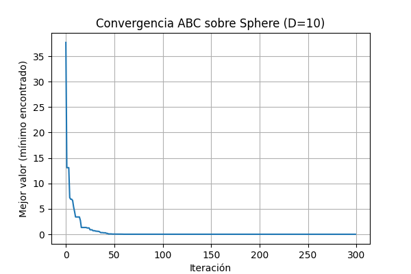

# Artificial Bee Colony (ABC)

Implementación didáctica del algoritmo **Artificial Bee Colony (ABC)** en Python.  
Este repositorio contiene el script `artificial_bee_colony.py` que implementa ABC y lo ejecuta sobre la función de prueba **Sphere**. 
El objetivo es mostrar la convergencia del algoritmo y mostrar la gráfica resultante.



Requisitos
----------
- Python 3.8+  
- Paquetes Python:
```bash
  pip install numpy matplotlib
```